# Terraform Azure WordPress

Deploy production-ready WordPress sites on Azure with Cloudflare CDN using Terraform/OpenTofu.

## Features

- **Azure App Service** (Linux) with managed WordPress container
- **Azure MySQL Flexible Server** with Private Endpoint (secure database access)
- **Azure Blob Storage** for media uploads (no Azure Files latency)
- **Cloudflare CDN** with DNS management and SSL (cost-optimized)
- **Azure Front Door** alternative with WAF (enterprise option)
- **Key Vault** for secrets management with managed identity
- **Application Insights** for monitoring and alerting
- **Shared App Service Plans** for multi-site cost optimization

## Architecture


```text
┌──────────────────────────────────────────────────────────────────┐
│                        Cloudflare Edge                           │
│  ┌────────────────────────────────────────────────────────────┐  │
│  │  CDN + WAF + SSL + DDoS Protection                         │  │
│  └────────────────────────────────────────────────────────────┘  │
└────────────────────────────────────────────────────────────────┘
                              │
┌─────────────────────────────┴────────────────────────────────────┐
│                        Azure Region                              │
│  ┌────────────────────────────────────────────────────────────┐  │
│  │           Shared Resource Group (per environment)          │  │
│  │  ┌──────────────────────────────────────────────────────┐  │  │
│  │  │            Shared App Service Plan                   │  │  │
│  │  │  ┌─────────────┐  ┌─────────────┐  ┌─────────────┐  │  │  │
│  │  │  │   Site 1    │  │   Site 2    │  │   Site N    │  │  │  │
│  │  │  │  WordPress  │  │  WordPress  │  │  WordPress  │  │  │  │
│  │  │  └─────────────┘  └─────────────┘  └─────────────┘  │  │  │
│  │  └──────────────────────────────────────────────────────┘  │  │
│  └────────────────────────────────────────────────────────────┘  │
│                                                                  │
│  ┌────────────────────────────────────────────────────────────┐  │
│  │           Per-Site Resources                               │  │
│  │  ┌──────────────┐ ┌──────────────┐ ┌──────────────────┐   │  │
│  │  │ MySQL Server │ │ Blob Storage │ │     Key Vault    │   │  │
│  │  │   (Private)  │ │   (Media)    │ │    (Secrets)     │   │  │
│  │  └──────────────┘ └──────────────┘ └──────────────────────┘  │
│  └────────────────────────────────────────────────────────────┘  │
└──────────────────────────────────────────────────────────────────┘
```

### Infrastructure Overview

```mermaid
flowchart TB
    subgraph Internet["🌐 Internet"]
        Users[("👥 Users")]
    end

    subgraph Cloudflare["☁️ Cloudflare Edge"]
        CF_CDN["CDN Cache"]
        CF_WAF["WAF Protection"]
        CF_SSL["Universal SSL"]
        CF_DNS["DNS Management"]
    end

    subgraph Azure["☁️ Azure Region"]
        subgraph SharedRG["📦 Shared Resource Group"]
            ASP["App Service Plan\n(B1/P1v3)"]
            subgraph Sites["WordPress Sites"]
                Site1["🌐 Site 1"]
                Site2["🌐 Site 2"]
                SiteN["🌐 Site N"]
            end
        end

        subgraph SiteRG["📦 Per-Site Resources"]
            MySQL[("🗄️ MySQL\nPrivate Endpoint")]
            Storage[("📁 Blob Storage\nMedia Files")]
            KV["🔐 Key Vault\nSecrets"]
            AppInsights["📊 App Insights"]
        end

        subgraph Network["🔒 Private Network"]
            VNet["Virtual Network"]
            PrivateDNS["Private DNS Zone"]
        end
    end

    Users --> CF_CDN
    CF_CDN --> CF_WAF --> CF_SSL
    CF_SSL --> Site1 & Site2 & SiteN
    Site1 & Site2 & SiteN --> ASP
    Site1 --> MySQL & Storage & KV
    MySQL -.-> VNet
    VNet -.-> PrivateDNS
```



### Module Dependency Flow


### Request Flow


## Quick Start

### Prerequisites

- [Terraform](https://www.terraform.io/downloads.html) >= 1.6.0 or [OpenTofu](https://opentofu.org/)
- Azure CLI with active subscription
- Cloudflare account with domain

### Basic Usage

```hcl
module "wordpress_site" {
  source = "github.com/agenticcodingops/terraform-azure-wordpress//modules/wordpress-site"

  project_name  = "myproject"
  site_name     = "blog"
  environment   = "nonprod"
  location      = "eastus"
  tenant_id     = data.azurerm_client_config.current.tenant_id
  custom_domain = "blog.example.com"

  cdn_provider = "cloudflare"
  cloudflare = {
    enabled    = true
    account_id = var.cloudflare_account_id
    domain     = "example.com"
    subdomain  = "blog"
  }
}
```

See [examples/](examples/) for complete configurations.

## Modules

| Module | Description |
|--------|-------------|
| [wordpress-site](modules/wordpress-site/) | Complete WordPress deployment composition |
| [shared-infrastructure](modules/shared-infrastructure/) | Shared App Service Plan for multi-site |
| [app-service](modules/app-service/) | Azure App Service for WordPress |
| [database](modules/database/) | Azure MySQL Flexible Server |
| [storage](modules/storage/) | Azure Blob Storage for media |
| [key-vault](modules/key-vault/) | Azure Key Vault for secrets |
| [networking](modules/networking/) | VNet and subnets |
| [dns-zones](modules/dns-zones/) | Private DNS zones |
| [cloudflare](modules/cloudflare/) | Cloudflare DNS and CDN |
| [front-door](modules/front-door/) | Azure Front Door CDN + WAF |
| [monitoring](modules/monitoring/) | Application Insights and alerts |

### Module Composition

```mermaid
flowchart TB
    subgraph User["Your Terraform Config"]
        MAIN["main.tf"]
    end

    subgraph Shared["shared-infrastructure"]
        ASP["App Service Plan"]
        RG_S["Resource Group"]
    end

    subgraph WPSite["wordpress-site (composition)"]
        RG["Resource Group"]

        subgraph L1["Layer 1: Foundation"]
            NET["networking\n• VNet\n• Subnets\n• NSGs"]
            DNS["dns-zones\n• Private DNS\n• VNet Links"]
        end

        subgraph L2["Layer 2: Application"]
            DB["database\n• MySQL Flexible\n• Private Endpoint"]
            STOR["storage\n• Blob Container\n• Media Files"]
            KV["key-vault\n• Secrets\n• Access Policies"]
            APP["app-service\n• Linux Web App\n• Managed Identity"]
            MON["monitoring\n• App Insights\n• Alerts"]
            FD["front-door\n• CDN\n• WAF"]
        end

        CF["cloudflare\n• DNS Records\n• Proxy Settings"]
    end

    MAIN --> Shared
    MAIN --> WPSite
    Shared --> |"plan_id"| APP
    RG --> L1
    L1 --> L2
    NET --> DNS
    DNS --> DB
    STOR --> KV
    KV --> APP
    DB --> APP
    APP --> MON
    APP --> FD
    APP --> CF
```



## CDN Options

| Provider | Cost | WAF | SSL | Best For |
|----------|------|-----|-----|----------|
| `cloudflare` | Free tier available | Free | Universal SSL | Cost-optimized deployments |
| `azure_front_door` | ~$35/month base | Included (Premium) | Managed certs | Enterprise, compliance |
| `direct` | None | None | App Service cert | Dev/testing |

## Cost Optimization

### Shared App Service Plans

Deploy multiple WordPress sites on a single App Service Plan:

```hcl
module "shared" {
  source = "github.com/agenticcodingops/terraform-azure-wordpress//modules/shared-infrastructure"

  project_name       = "myproject"
  environment        = "nonprod"
  location           = "eastus"
  app_service_sku    = "B1"  # Start small, scale up as needed
}

module "site1" {
  source = "github.com/agenticcodingops/terraform-azure-wordpress//modules/wordpress-site"

  project_name = "myproject"
  site_name    = "site1"
  # ... other config ...

  app_service = {
    plan_id        = module.shared.app_service_plan_id
    use_shared_plan = true
  }
  shared_resource_group_name = module.shared.resource_group_name
  shared_plan_sku            = "B1"
}
```

**Cost Savings**: ~50% reduction by consolidating plans.

### SKU Recommendations

| Environment | App Service | MySQL | Estimated Cost |
|-------------|-------------|-------|----------------|
| Dev/Test | B1 (shared) | B_Standard_B2s | ~$40/month/site |
| Production | P1v3 (shared) | GP_Standard_D2ds_v4 | ~$150/month/site |

## Security

- **VNet Integration**: App Service connects to MySQL via private endpoint
- **Managed Identity**: No credentials stored in code
- **Key Vault References**: Secrets loaded at runtime
- **IP Restrictions**: Only Cloudflare IPs can reach origin (when enabled)
- **TLS 1.2**: Minimum version enforced everywhere

## Requirements

| Name | Version |
|------|---------|
| terraform | >= 1.6.0 |
| azurerm | >= 4.0.0 |
| azapi | >= 1.12.0 |
| cloudflare | >= 4.0.0 |

## Contributing

Contributions are welcome! Please read our contributing guidelines before submitting PRs.

## License

Apache License 2.0 - see [LICENSE](LICENSE) for details.
